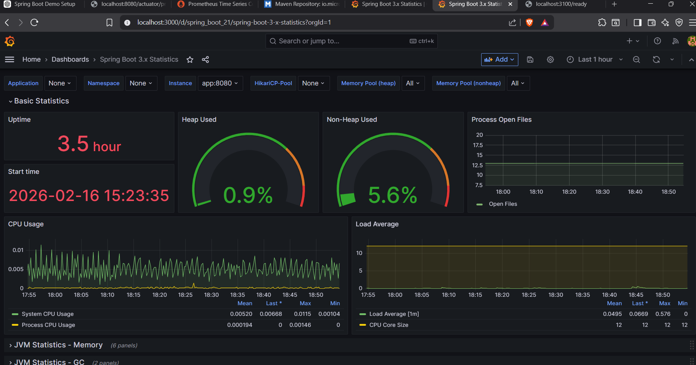
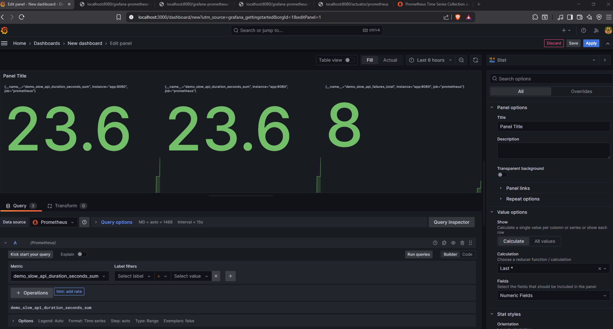
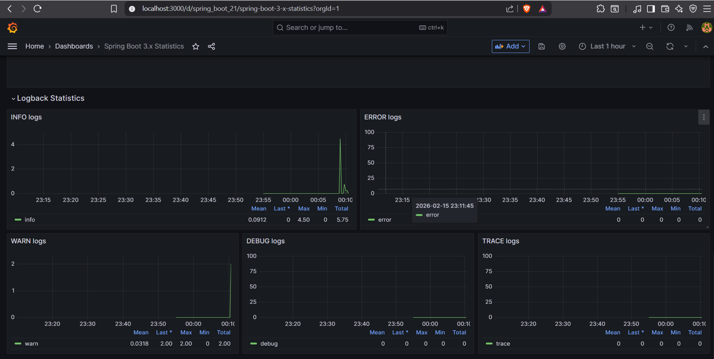
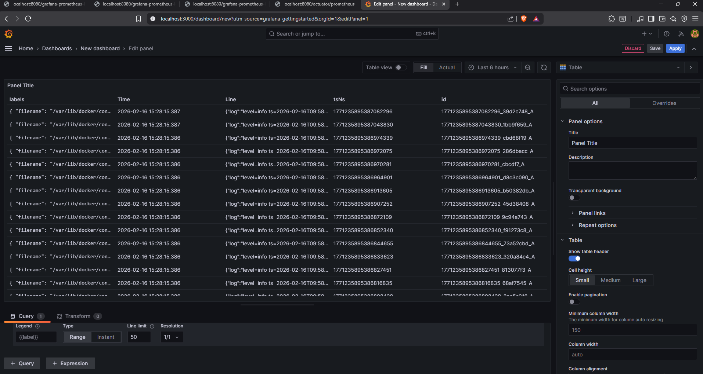

# grafana-prometheus-loki

Spring Boot 4 demo application showing **end?to?end observability** with **Prometheus**, **Grafana**, **Loki**, and **Promtail**, all running via Docker Compose.

This repo is designed to be:

- **Recruiter friendly** ? clearly shows experience with Spring Boot, Micrometer, Docker, Prometheus, Grafana, and Loki.
- **Future?me friendly** ? if you come back in 6+ months, you can follow this README step by step and get everything running again.

---

## At a glance

- **Tech stack**
  - **Java 21**, **Spring Boot 4**
  - **Spring Boot Actuator** + **Micrometer Prometheus registry**
  - **Prometheus** for metrics scraping
  - **Grafana** for dashboards
  - **Loki + Promtail** for centralized log collection
  - **Docker / Docker Compose** for local orchestration
- **Key REST endpoints**
  - `GET /grafana-prometheus-loki/hello` ? simple health/demo endpoint
  - `GET /grafana-prometheus-loki/slow` ? random latency + random 500s, tracked with Micrometer `Timer` and `Counter`
  - `GET /grafana-prometheus-loki/log` ? emits a WARN log to demonstrate log shipping to Loki
- **Metrics**
  - `demo_slow_api_duration` ? latency distribution for `/slow`
  - `demo_slow_api_failures_total` ? number of random failures from `/slow`

---

## Quick start (for future me & reviewers)

If you just want to see everything working:

1. **Build the JAR**
   ```bash
   mvn clean package -DskipTests
   ```
2. **Start the full stack**
   ```bash
   docker-compose up --build
   ```
3. Open in your browser:
   - **App**: `http://localhost:8080`
   - **Prometheus**: `http://localhost:9090`
   - **Grafana**: `http://localhost:3000`
4. Hit the demo endpoints a few times (`/hello`, `/slow`, `/log`) and then explore:
   - Metrics in Prometheus & Grafana
   - Logs in Loki (via Grafana Explore)

When finished:

```bash
docker-compose down
```

---

## Running the Spring Boot app only (no Docker)

Prerequisites:

- **Java 21+**
- **Maven 3.9+**

From the project root:

```bash
mvn spring-boot:run
```

The app will start on `http://localhost:8080`.

- **REST endpoints**
  - `http://localhost:8080/grafana-prometheus-loki/hello`
  - `http://localhost:8080/grafana-prometheus-loki/slow`
  - `http://localhost:8080/grafana-prometheus-loki/log`
- **Prometheus metrics**
  - `http://localhost:8080/actuator/prometheus`

> Note: In this mode you only get the Spring Boot app and raw metrics endpoint. Prometheus, Grafana, Loki and Promtail are only available when you run with Docker Compose.

---

## Full observability stack (Docker Compose)

Services defined in `docker-compose.yml`:

- **app** ? Spring Boot application (built from this repo)
- **prom-server** ? Prometheus, scraping the app?s `/actuator/prometheus` endpoint
- **grafana** ? dashboards and log exploration
- **loki** ? log storage
- **promtail** ? ships Docker container logs into Loki

### How Prometheus is configured

- Configuration: `prometheus-config.yml` (mounted into the Prometheus container).
- Global scrape interval: **4s**
- Scrape target:
  - Job: `prometheus`
  - Target: `app:8080`
  - Metrics path: `/actuator/prometheus`

### How logging works (Loki + Promtail)

- `promtail-config.yml` tells Promtail to:
  - Read Docker logs from `/var/lib/docker/containers/*/*.log`
  - Push them to Loki at `http://loki:3100/loki/api/v1/push`
- When you call:
  - `/grafana-prometheus-loki/log` ? generates a WARN log
  - `/grafana-prometheus-loki/slow` ? generates INFO/WARN logs based on success/failure
- Those logs are collected by Promtail and end up queryable in Loki (via Grafana).

---

## Using Grafana

Once `docker-compose up` is running, open:

- `http://localhost:3000`

Default credentials (unless changed):

- **User**: `admin`
- **Password**: `admin`

Inside Grafana:

1. **Add Prometheus data source**
   - Type: **Prometheus**
   - URL: `http://prom-server:9090`
2. **Add Loki data source**
   - Type: **Loki**
   - URL: `http://loki:3100`
3. Build dashboards using metrics such as:
   - `demo_slow_api_duration`
   - `demo_slow_api_failures_total`
4. Use **Explore ? Loki** to query logs for the app (e.g. filter by `job="docker"` or container labels).

---

## Screenshots (GitHub proof)

Screenshots for this project live in:

- `docs/screenshots/`

If you are viewing this on GitHub and the images have been committed, you should see them rendered below.

Current screenshots (filenames can be adjusted as needed):


Grafana dashboard showing Prometheus metrics from the Spring Boot app (including custom slow API metrics).


Panel highlighting the custom Micrometer timer/gauge for the `/slow` endpoint latency.


Time-series view of log-related events visualized from Prometheus data.


Loki/Promtail view confirming that application logs from the Docker containers are being collected successfully.

You can add more screenshots to `docs/screenshots/` and reference them with the same `` pattern.

---

## Useful curl examples

With Docker Compose running:

```bash
# Simple hello endpoint
curl http://localhost:8080/grafana-prometheus-loki/hello

# Trigger slow API (random latency + random 500)
curl -i http://localhost:8080/grafana-prometheus-loki/slow

# Emit a WARN log that should appear in Loki
curl http://localhost:8080/grafana-prometheus-loki/log
```

---

## Project structure (high level)

- `pom.xml` ? Maven configuration (Spring Boot, Actuator, Micrometer Prometheus)
- `Dockerfile` ? Container image definition for the Spring Boot app
- `docker-compose.yml` ? Orchestrates app + Prometheus + Grafana + Loki + Promtail
- `prometheus-config.yml` ? Prometheus scrape config for the app
- `promtail-config.yml` ? Promtail config for shipping Docker logs to Loki
- `src/main/java/.../GrafanaPrometheusLokiApplication.java` ? Spring Boot main class
- `src/main/java/.../controller/MetricsController.java` ? Demo REST endpoints and Micrometer metrics
- `src/main/resources/application.yml` ? Spring Boot & Actuator configuration
- `docs/screenshots/` ? Screenshots used in this README / on GitHub

---

## Notes for future me

- Make sure **Docker Desktop** (or equivalent) is running before `docker-compose up`.
- If ports `8080`, `9090`, `3000`, or `3100` are already in use, stop the conflicting services or update `docker-compose.yml`.
- If Grafana doesn?t show data:
  - Check that Prometheus can reach `app:8080` under **Status ? Targets**.
  - Make a few requests to `/slow` and `/log` first so there is data.

